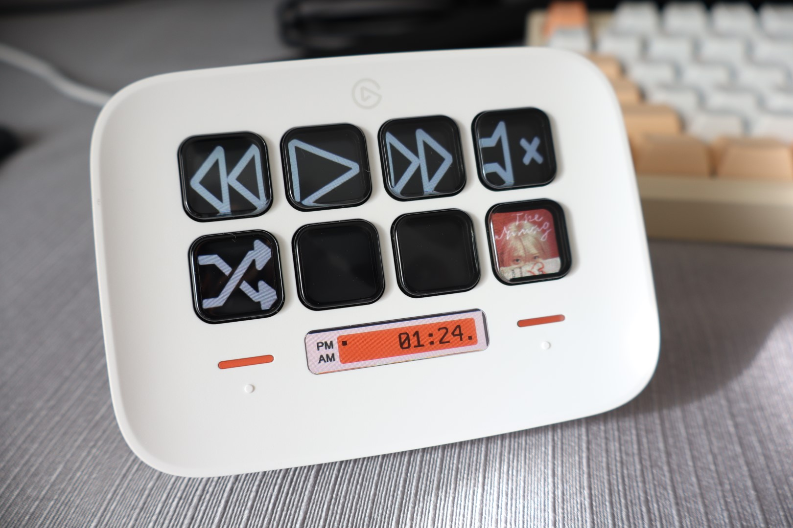
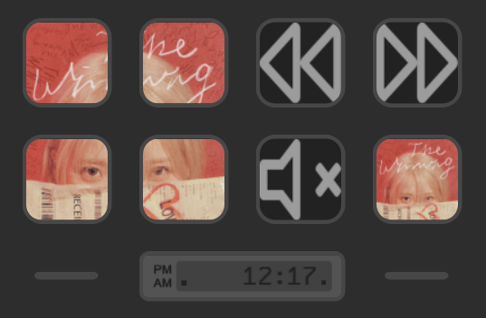

# YouTube Music Controller (for StreamDeck & th-ch/youtube-music)

> [!NOTE]
> This plugin was inspired by [XeroxDev/YTMD-StreamDeck](https://github.com/XeroxDev/YTMD-StreamDeck).
> 
> The plugin's icons are also taken from YTMD-StreamDeck, for now.

This StreamDeck plugin allows you to control the [YouTube Music Desktop app](https://github.com/th-ch/youtube-music).

Requires v.3.7.1 or later of the YouTube Music Desktop app.

## Actions
- Toggle play/pause
- Next track
- Previous track
- Like
- Shuffle
- Repeat
- Track Info
  - Shows scrolling text for title, author, and/or album
  - Shows album art/thumbnail, either in one button or in a 2x2 grid
- Toggle mute/unmute

## Installation

1. Download the latest release from the [Releases](https://github.com/kimjammer/youtube-music-controller/releases)
2. Double click to install the plugin.
3. Open the youtube-music desktop app, and Enable Plugins/API Server [Beta]
4. Open the StreamDeck app, and add the Toggle Play/Pause Action
5. The default host and port should be correct, but if not, change to match youtube-music
6. Press Save & Authorize
7. Allow the authorization in youtube-music

## Future

Ideally, this plugin should not exist, and support for th-ch/youtube-music
should be integrated into XeroxDev/YTMD-StreamDeck. I spent a bunch of
time trying to get this to work out, but since I'm not familiar with
StreamDeck plugin development and various blockers I ran into, I just
threw this plugin together. For future reference, here are the blockers
I found that will need to be fixed for this to happen.

### Requirements for XeroxDev/YTMD-StreamDeck support of th-ch/youtube-music
- Websocket/Server-Sent API
- API to get on/off status of like, dislike, mute
- API to get current volume level
- Reimplementation of ytmdesktop-ts-companion for th-ch/youtube-music
  - ytmdesktop-ts-companion is fairly tightly coupled to ytmdesktop, making
  this not trivial.
  - Ex: in youtube-music, there are different endpoints for "/play, /next, etc"
  while in ytmdesktop there is only "/command" and {"command": "play, next, etc"} is passed.